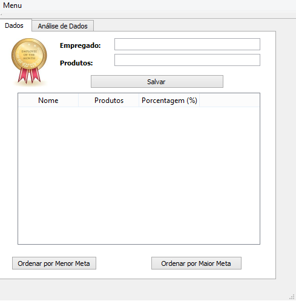
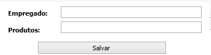
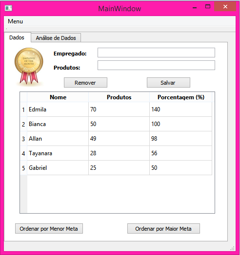
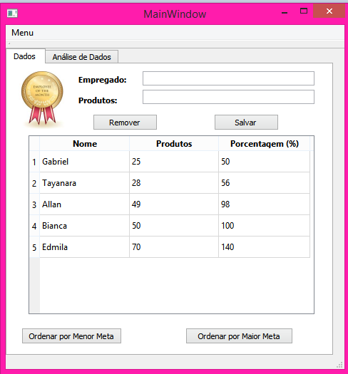
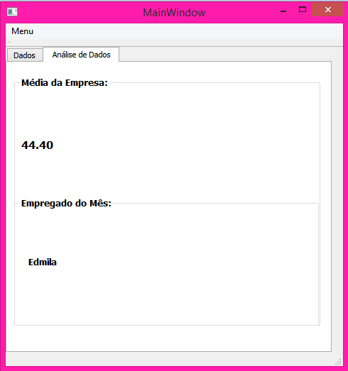
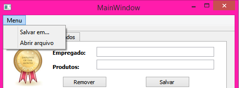
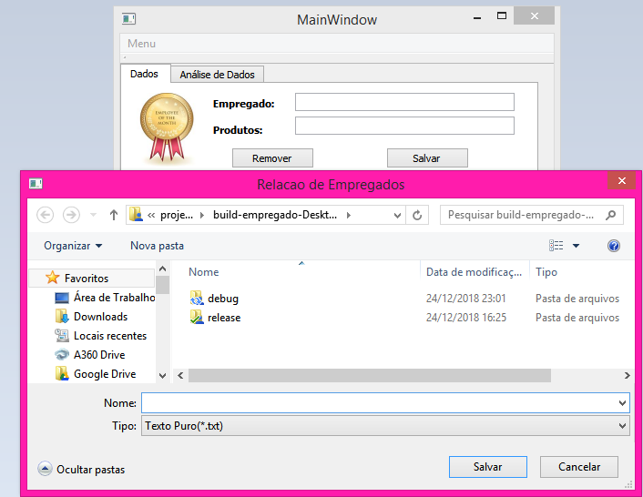
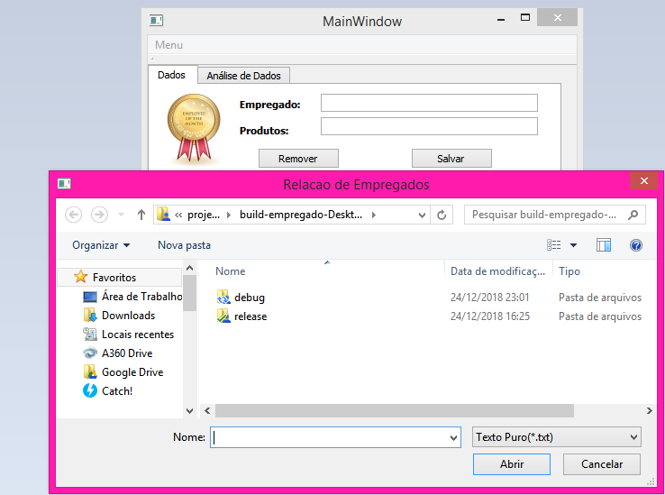

# Empregado do Mês

Este código possui a finalidade de inserir os dados dos empregados de uma empresa e mostrar o seu funcionário do mês. O usuário entra com o nome e a quantidade de produtos vendidos pelo empregado. A interface por onde os dados são inseridos é mostrada abaixo.

# Inserção de Dados

Para inserir os dados é muito simples! Basta colocar o nome do empregado, a quantidade de produtos vendidos e clicar em salvar.

# Organizanização

Caso queira, também é possível organizar os dados de acordo com a meta. Só precisa clicar no botão de sua preferência que os dados serão organizados.

 

# Análise de Dados

O código possui uma aba onde é possível obervar o desempenho da empresa a partir de uma média da empresa que leva em conta a quantidade de produtos vendidos pelos empregados, assim como ver o empregado que mais vendeu durante o mês.

# Salvar e Abrir arquivos

Também é possível salvar ou abrir um arquivo já existente.

# Mensagens

Caso de algum problema no carregamento ou no salvamento dos dados aparecerá uma das seguintes mensagens:

## Observação:
A meta para os produtos vendidos pode ser alterada no arquivo "empregado.h" pois assim evita que alguém com más intenções acabe alterando os dados e prejudicando a atuação da empresa.
